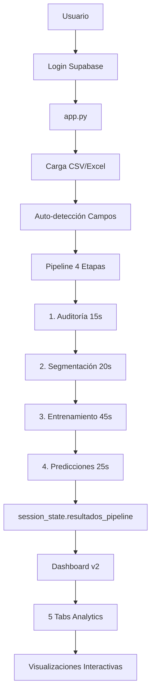

# 📁 CEAPSI - Estructura del Proyecto v2.0

## 🎯 **Arquitectura Simplificada con Analytics Avanzado**

```
CEAPSI/
├── 📄 app.py                               # ✅ Aplicación principal (2007 líneas)
├── 📄 app_legacy.py                        # 📦 Backup versión anterior
├── 📄 app_too_optimized.py                 # 📦 Versión experimental
├── 📄 requirements.txt                     # ✅ Dependencies actualizadas
├── 📄 .env.example                         # ✅ Template configuración
├── 📄 README.md                            # ✅ Documentación principal
├── 📄 CLAUDE.md                            # ✅ Guía para Claude Code
├── 📄 PROJECT_STRUCTURE.md                 # 📋 Este archivo
│
├── 📁 src/                                 # Código fuente modular
│   ├── 📁 ui/                             # Interfaz de usuario
│   │   ├── dashboard_comparacion_v2.py    # ✅ Dashboard v2 con 5 tabs
│   │   ├── dashboard_analytics.py         # ✅ Módulo de analytics
│   │   ├── components/                    # ✅ Componentes modulares
│   │   │   ├── data_loader.py            # Carga de datos
│   │   │   ├── data_validator.py         # Validación y filtrado
│   │   │   └── chart_visualizer.py       # Visualizaciones
│   │   ├── optimized_frontend.py          # Componentes UI optimizados
│   │   ├── historial_sesiones.py         # Historial de sesiones
│   │   └── ux_mejoras.py                  # Mejoras UX/UI
│   ├── 📁 auth/                           # Autenticación
│   │   ├── supabase_auth.py              # ✅ Auth con Supabase
│   │   └── security_check.py             # Verificaciones de seguridad
│   ├── 📁 core/                           # Funcionalidades núcleo
│   │   ├── field_detector.py             # ✅ Auto-detección de campos
│   │   └── preparacion_datos.py          # Preparación de datos
│   ├── 📁 models/                         # Machine Learning
│   │   ├── sistema_multi_modelo.py       # Ensemble de 4 modelos
│   │   └── optimizacion_hiperparametros.py # Optimización HP
│   ├── 📁 api/                            # APIs externas
│   │   └── modulo_estado_reservo.py      # API Reservo
│   ├── 📁 services/                       # Servicios de procesamiento
│   │   ├── auditoria_datos_llamadas.py   # Auditoría de datos
│   │   ├── segmentacion_llamadas.py      # Segmentación
│   │   └── automatizacion_completa.py    # Pipeline completo
│   └── 📁 utils/                          # Utilidades
│       └── feriados_chilenos.py          # Gestión feriados chilenos
│
├── 📁 backend/                            # Backend FastAPI (Opcional)
│   └── 📁 app/                           # Aplicación FastAPI
│       ├── 📄 main.py                    # App principal
│       ├── 📁 core/                      # Núcleo del backend
│       │   ├── rate_limiter.py          # Rate limiting
│       │   ├── file_validation.py       # Validación de archivos
│       │   ├── error_handler.py         # Manejo de errores
│       │   ├── supabase_auth.py         # Auth backend
│       │   └── config.py                # Configuración
│       ├── 📁 api/                       # Endpoints REST
│       │   └── 📁 routers/               # Rutas modulares
│       └── 📄 requirements.txt          # Dependencies backend
│
├── 📁 database/                           # Base de datos
│   └── 📁 migrations/                     # Migraciones SQL
│       ├── 001_create_analysis_sessions.sql
│       └── 002_audit_system.sql
│
├── 📁 docs/                               # Documentación
│   ├── 📄 README.md                      # Docs principales
│   ├── 📄 CLAUDE.md                      # Guía técnica
│   └── 📁 architecture/                   # Arquitectura
│       └── ARCHITECTURE.md
│
├── 📁 assets/                             # Recursos estáticos
│   └── 📁 data/                          # Datos de ejemplo
│       ├── ejemplo_datos_llamadas.csv
│       └── feriadoschile.csv
│
├── 📁 config/                             # Configuración
│   └── streamlit_config.toml             # Config Streamlit
│
├── 📁 scripts/                            # Scripts de utilidad
│   └── 📁 development/                    # Scripts desarrollo
│       └── run.py                        # Launcher
│
└── 📁 logs/                               # Logs del sistema
    └── ceapsi_app.log                    # Log principal
```

## 🚀 **Características v2.0**

### **📊 Dashboard v2 - Analytics Avanzado**

```yaml
5 Tabs de Análisis:
  ✅ Predicciones vs Real - Navegación mejorada
  ✅ Análisis de Residuales - Temporal y distribución
  ✅ Métricas de Performance - Comparación de modelos
  ✅ Mapas de Calor - 3 vistas temporales
  ✅ Recomendaciones - En desarrollo

Nuevas Visualizaciones:
  ✅ Heatmap Semanal (20 semanas)
  ✅ Heatmap Horario (días vs horas)
  ✅ Calendario Mensual (90 días)
  ✅ Análisis de Estabilidad
  ✅ Comparación entre Períodos
```

### **⚡ Optimizaciones de Performance**

```yaml
Pipeline Optimizado:
  ✅ ~5 segundos para 341k registros
  ✅ 4 etapas con logging detallado
  ✅ Monitor de recursos (CPU/RAM)
  ✅ Auto-detección de campos

Visualización:
  ✅ Sampling inteligente (10k puntos)
  ✅ Cache con TTL 5 minutos
  ✅ Lazy loading de componentes
  ✅ Gráficos Plotly responsivos
```

### **🤖 Machine Learning**

```yaml
Modelos:
  ✅ Prophet - Series temporales
  ✅ ARIMA - Modelo estadístico
  ✅ Random Forest - Ensemble
  ✅ Gradient Boosting - Boosting

Métricas:
  ✅ MAE, RMSE, MAPE, R²
  ✅ Interpretación automática
  ✅ Ranking de modelos
  ✅ Análisis de residuales
```

### **🔐 Seguridad y Autenticación**

```yaml
Autenticación:
  ✅ Supabase JWT obligatorio
  ✅ ANON_KEY para frontend
  ✅ SERVICE_ROLE_KEY solo backend
  ✅ Login requerido

Validación:
  ✅ Detección de encodings
  ✅ Filtrado de fechas futuras
  ✅ Mapeo inteligente de campos
  ✅ Asignación automática usuarios
```

## 📊 **Flujo de Datos**



## 🔧 **Configuración**

### **Variables de Entorno (.env)**

```bash
# Supabase (Requerido)
SUPABASE_URL=https://your-project.supabase.co
SUPABASE_ANON_KEY=your-anon-key
SUPABASE_SERVICE_ROLE_KEY=your-service-role-key

# APIs Externas (Opcional)
API_KEY=Token your-reservo-api-key
API_URL=https://reservo.cl/APIpublica/v2

# Desarrollo
ENVIRONMENT=development
DEBUG=false
```

### **Ejecución**

```bash
# Instalar dependencias
pip install -r requirements.txt

# Ejecutar aplicación
streamlit run app.py

# Desarrollo con hot-reload
python scripts/development/run.py
```

## 📈 **Métricas de Performance**

```yaml
Velocidad:
  Pipeline: ~5 segundos (341k registros)
  Dashboard: <1 segundo navegación
  Login: <2 segundos

Recursos:
  RAM: ~140MB en ejecución
  CPU: Picos durante pipeline
  Cache: 5 min TTL

Escalabilidad:
  Óptimo: <500k registros
  Máximo: 1M registros
  Sampling: Automático >10k puntos
```

## 🚨 **Cambios Importantes v2.0**

### **✅ Implementado**
- Dashboard v2 con analytics avanzado
- Análisis de residuales completo
- Métricas de performance detalladas
- 3 tipos de mapas de calor
- Análisis de estabilidad temporal
- Comparación entre períodos
- Auto-detección de campos CSV/Excel
- Monitor de recursos en tiempo real

### **❌ Eliminado**
- Dashboard v1 (dashboard_comparacion.py)
- Sistema MCP (mcp_init.py, mcp_session_manager.py)
- Referencias a variables indefinidas
- Toggle v1/v2 en sidebar

### **🚧 En Desarrollo**
- Tab de recomendaciones automáticas
- Análisis cruzado con datos de usuarios
- Exportación avanzada de reportes

---

**CEAPSI v2.0** - Sistema de Análisis Inteligente para Call Center 🚀